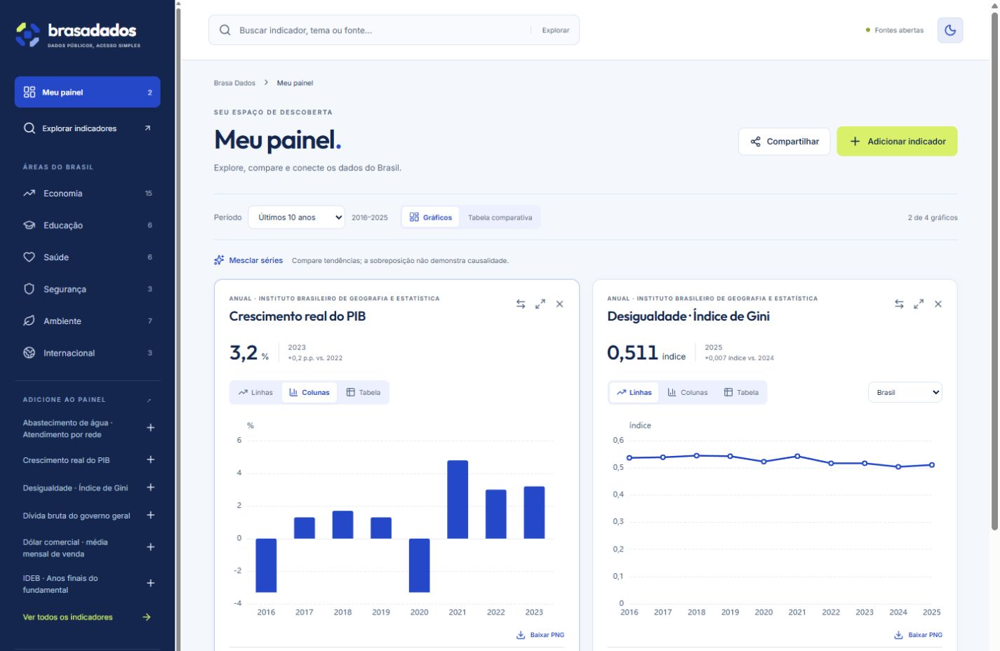

# Brasa Dados · Atlas Cívico

Consulta e comparação de indicadores públicos brasileiros. React, TypeScript e ECharts, com hospedagem estática e navegação por hash compatível com GitHub Pages.

Site publicado: [bdsromulo.github.io/BrasaDados](https://bdsromulo.github.io/BrasaDados/).

## Executar

Use Node.js 22.18+ ou 24.

```sh
npm ci
npm run dev
npm test
npm run build
npm run preview
```

O build valida os arquivos de dados antes da compilação. A publicação existente no GitHub Pages também exige testes aprovados.

## Experiência

- Identidade Atlas Cívico: logo SVG, Outfit e Inter locais, temas claro e escuro.
- Até quatro gráficos, adicionados por botão, seletor ou arraste. Preview de disposição, substituição explícita, remover/desfazer e maximização sem descartar cartões.
- Linhas ou colunas recomendadas por indicador; ranking horizontal, opções secundárias e restauração da recomendação.
- Abaixo de 768 px: explorar, consultar e comparar por toque. De 768 a 1023 px: catálogo recolhido. A partir de 1024 px: bancada com catálogo lateral.
- Períodos relativos aos dados disponíveis, tabela comparativa, CSV do recorte e PNG identificado.
- Busca sem distinção de acentos e com sinônimos; links de indicadores/comparações e persistência local.
- Catálogo, arquivos por indicador e motor gráfico carregados separadamente; gráficos fora da tela são adiados.

## Situação dos dados

Em 27/09/2026: **40 indicadores, dos quais 27 têm extração/transcrição conferida e 13 continuam em revisão numérica**. O inventário dos 32 indicadores originais registra divergências de referências, frequência e cobertura. Não é uma certificação de todos os valores do acervo.

O primeiro lote acrescenta rendimento domiciliar per capita, pobreza/extrema pobreza, informalidade, insegurança alimentar por gravidade, abastecimento de água, tratamento de esgoto e IDEB dos anos iniciais e finais. A Selic Meta foi corrigida para a série SGS 432. Também foram revisadas as séries de mortes violentas, feminicídios, percepção da corrupção, matriz elétrica renovável e focos ativos de fogo. Rankings legados sem período documentado não são apresentados como rankings atuais.

Indicadores em revisão têm aviso nos cartões, no catálogo e nas exportações e ficam fora da mesclagem. O filtro “Conferidos na fonte” permite restringir a consulta.

## Documentação

- [Arquitetura](REPOSITORIO.md)
- [Importadores e atualização](PIPELINES.md)
- [Metodologia e limites](METODOLOGIA_DADOS.md)
- [Inventário de auditoria](docs/AUDITORIA.md)
- [Validação da interface](docs/VALIDACAO.md)
- [Entregas e pendências](TAREFAS.md)


